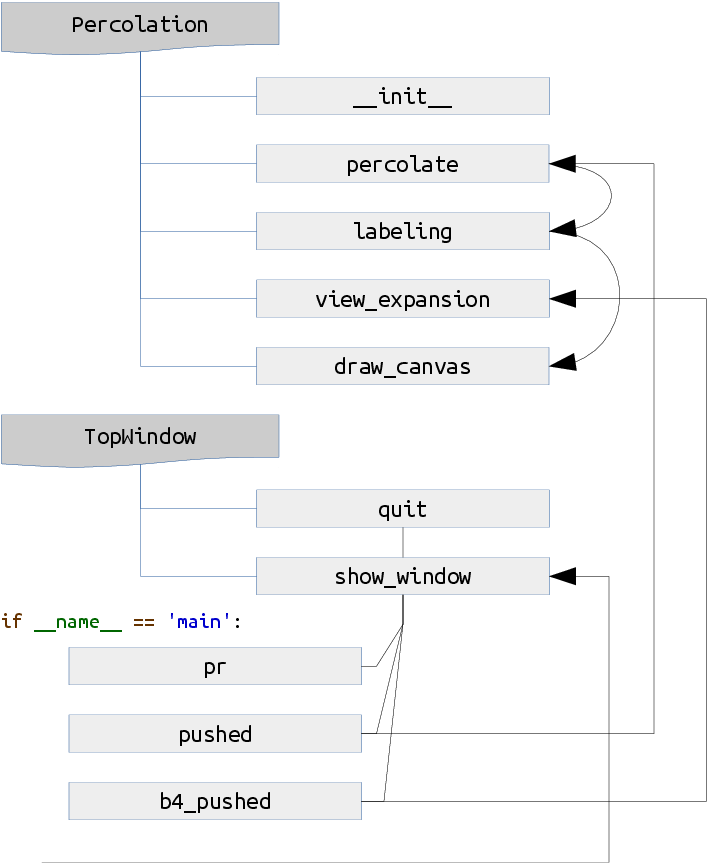
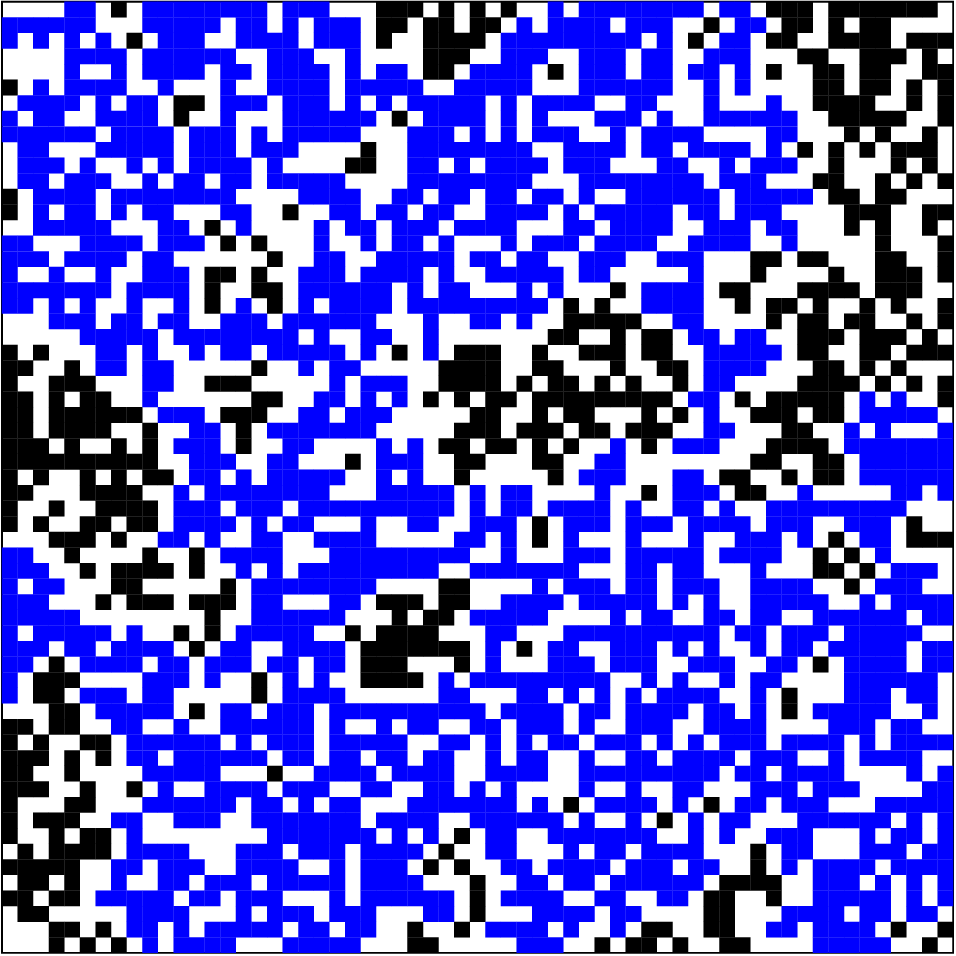
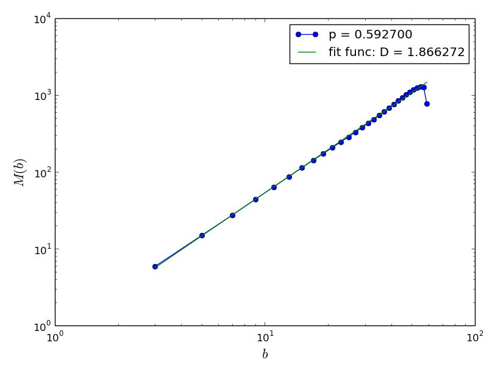

.. _14-1-label:

===============================================================================
問題14.1 - パーコレーション・クラスターのフラクタル次元
===============================================================================

.. contents::

シミュレーションの目的
===============================================================================

フラクタル図形の面積は、一般にユークリッド次元での物体として面積を求めることはできない。このことを特徴づけるための量として、フラクタル次元が定義されている。この概念の説明のために普通のユークリッド幾何学における次元について、簡単な考えのいくつかを復習することにする。質量が\ :math:`M`\ で半径が\ :math:`R`\ の円や球状の物体を考えてみる。物体の半径を\ :math:`R`\ から\ :math:`2R`\ と2倍にすると、もし物体が円形であれば質量は\ :math:`2^{2}`\ に、球状であれば\ :math:`2^{3}`\ に増大する。質量と長さの間のこのような関係は

.. math:: M(R) \sim R^{D}\ \ \ (質量次元)
    :label: 14-1-e1

と表すことができる。ここで\ :math:`D`\ は物体の次元である。式\ :eq:`14-1-e1`\ は、形を保ったまま物体の差し渡しの大きさを\ :math:`b`\ 倍にするとその物体の質量が\ :math:`b^{D}`\ に増大することを意味している。このような質量と長さの間のスケーリングの関係は、次元についての我々の直感的理解と密接な関係がある。物体の次元\ :math:`D`\ と、その物体が置かれているユークリッド次元\ :math:`d`\ とが等しければ、質量密度\ :math:`\rho = M/R^{d}`\ は

.. math:: \rho(R) \propto M/R^{d} \sim R^{0}
    :label: 14-1-e2

とスケールされる。質量と長さの関係が式\ :eq:`14-1-e1`\ を満たし、かつ\ :math:`D=d`\ であるような物体はコンパクトであると言われる。
式\ :eq:`14-1-e1`\ を使ってフラクタル次元が定義できる。もしある対象について式\ :eq:`14-1-e1`\ が成り立ち、\ :math:`D`\ の値が空間次元\ :math:`d`\ と異なる値をとるとき、その対象はフラクタルであると呼ぶ。もしある物体に対して式\ :eq:`14-1-e1`\ が満たされ\ :math:`D < d`\ であるとき、その密度はすべての\ :math:`R`\ に対して同じではなく、

.. math:: \rho(R) \propto M/R^{d}  \sim R^{D-d}

のようにスケールされる。\ :math:`D<d`\ なので、フラクタルな物体の密度は大きなスケールで見るほど小さくなる。密度のこのようなスケール依存性はフラクタルな対象がどの程度入り組んでいるか、あるいはひも状であるかについての定量的な尺度である。つまり、フラクタルな対象の特徴の1つは、あらゆる大きさのでこぼこな穴が存在すことである。

フラクタルな対象の持つもうひとつの重要な特徴は、長さのスケールのある範囲にわたって、それらが同じに見えることである。この自己相似性またはスケール不変性は、フラクタルな対象の一部を取り出し、それを全ての方向について同じ倍率で拡大しても、その拡大された図形はもとのものと区別できないことを意味する。

問題14.1では簡単なモンテカルロ法を用いて、パーコレーション・クラスターのフラクタル次元の計算を行う。\ :math:`M`\ と\ :math:`R`\ 間のベキ乗則の関係に対する説得力のある証拠を得る場合や、フラクタル次元を高い精度で求める場合には数十組のデータが必要であることを思い出そう。したがって、それらの問題での限られたシミュレーションに基づいた結論は注意深く解釈されなければならない。

作成したプログラム
===============================================================================

本シミュレーションで作成したプログラムを以下に示す。

パーコレーション・クラスターのフラクタル次元を求めるプログラム
-------------------------------------------------------------------------------

以下に、プログラム全体の概略図を示す。

    

このプログラムにおいて、クラスPercolateがシミュレーションに関して本質的な部分である。クラスTopWindowはサイトの占有確率\ :math:`p`\ を入力したり、シミュレーションを実行したり、得られた結果を図にしたりするためのボタンなどを、画面に配置するものである。

クラスPercolateでは、関数としてpercolate, labeling, view_expansion, draw_canvasが定義されている。

関数percolateは、与えられた確率で各サイトに粒子を配置することを行っている。

関数labelingではクラスターのラベル付けを行っている。教科書\ [1]_\ 13章に書かれているラベル付けのアルゴリズムを参考にしており、まず格子を表す行列で行番号、列番号の若いものから順番に走査する。一つ前の行と列を調べ、そこに粒子が存在する場合はそれらのうち小さい数を自分のラベルとし、一方そこに粒子が存在しない場合には、全体の通し番号\ :math:`n`\ を、新たに自身のラベルとする。ここまでが30〜43行目の内容である。この操作だけでは、隣接するクラスターが異なるラベルを持つということが起きて、適切なラベル付けはできないので、次に、これらのサイトに与えた数字を、隣接するクラスタが存在するとき、小さい方の数にラベルを揃えることを考える。ここでは新たにラベルの数字に対応するtagという配列を用意し、この配列の中の数を変えることによって、ラベルにおける数と、そのラベルが変更されるべき数を表すことができる。実際のアルゴリズムとしては、始めと逆向きに走査し、一つ行／列の数字が大きい2点に粒子が存在する場合、自分自身を含めた3点での最小値を求め、最小でない点におけるラベルを持つサイトをすべて、その最小値で置き換える。この操作を繰り返し行うことにより、クラスタのラベル付けを効率的よく適切に行うことができる。こうして得られたself.lattice(59行目)の、上下左右の行と列をみて、上と下、左と右で、どちらにも存在するようなラベルを探す。そのようなラベルを持つクラスターは、パーコレートしていると見なし、そのラベルはself.ptagに保存される(60〜64行目)。

関数view_expansionは、pecolate, labelingが実行された後に呼び出される必要があり、この関数によって、視野拡大法を用いたサイト・パーコレーションのフラクタル次元を求めることができる。具体的なアルゴリズムとしては、まず,self.ptagの1個目のラベルをもつサイトのラベルを1として、その他のサイトは全て0とする。次に、視野の大きさ\ :math:`b`\ を\ :math:`3, 5, \cdots, 2k+1, \cdots`\ というように変えていき、そのサイズの正方形を収めることのできる領域で、そのうちゼロでない領域に対して、そのそれぞれの点を原点とした1辺が\ :math:`b`\ の正方形の中に、占有されたサイトがいくつあるか(\ :math:`M(b)`\ )を数え上げる。各\ :math:`b`\ に対して、全ての可能な原点の取り方で得られた\ :math:`M(b)`\ を平均することで、より正確な値が得られる(67〜78行目)。\ :math:`b`\ について得られた\ :math:`M(b)`\ を、scipyパッケージの最小2乗法モジュールを用いてベキ乗則に近似し、もとのデータとあわせて両対数グラフにして画面に表示する(83〜110行目)。

最後にdraw_canvasについてだが、これはTkのCanvasメソッドを用いて、占有サイトを黒の正方形で表すものである。また、パーコレーション・クラスターは、青または緑、赤、紫の正方形で描画される。効率化のための工夫として、canvas.create_rectangleを毎回直接呼び出すのではなく、ローカル変数cに置き換えておき、それを呼び出すことによって、無駄な遅延が出ないようになっている。また、デフォルトサイズを決めておき、そのサイズから、描画するキャンバスの大きさと正方形の大きさを決定している。

* 14-1_fractal_dim_of_pc.py(\ :download:`download <14-1_fractal_dim_of_pc.py>`\ )

.. literalinclude:: 14-1_fractal_dim_of_pc.py
    :language: python
    :linenos:

実習課題
===============================================================================

* \ :math:`L=61`\ の正方格子上で\ :math:`p=0.5927`\ におけるサイト・パーコレーションのパターンを作成せよ。端から端まで連結したクラスターを得る前に多数の配置を生成しなければならない理由を考えよ。端から端まで連結したクラスターが入り組んだパターンを持つことを感覚的に理解するために、1つの配置を出力して、端から端まで連結したクラスター内の点に印をつけよ。その中に、一方が占有され、一方が占有されていない最隣接格子点の組は多く存在するか。

:math:`p=0.5927`\ におけるサイト・パーコレーションのパターンを作成し、これを\ :num:`図#fig-14-1-f1`\ に示す。パーコレートしたクラスタを青色で示し、その他のクラスタは黒色で描画してある。パーコレートしたクラスターを得るために多数の配置を生成しなければならないのは、\ :math:`p =0.5927`\ という値が、パーコレーション閾値\ :math:`p_{c}`\ に近い値であることによる\ [2]_\ 。すなわち、これより小さい\ :math:`p`\ では、ほとんどの配置でパーコレーションは起こらない。パーコレーションクラスター内の点で、一方が占有され、一方が占有されていない再隣接格子点の組は多く存在しており、空洞が多く、境界が入り組んだ構造を持っていることが分かる。

.. _fig-14-1-f1:

    
    \ :math:`p=0.5927`\ において得られたサイト・パーコレーションの例

* 端から端まで連結したクラスター内の1つの点を選んで、その点を中心にした\ :math:`b^{2}`\ の正方形の内部にある点の数\ :math:`M(b)`\ を数えよ。つぎに、\ :math:`b`\ を大きくして、その正方形の中の点の数を数えよ。点の数の\ :math:`b`\ 依存性が得られるまで、この手順を繰り返せ(視野拡大法)。この手順を無限に繰り返すことは可能か。\ :math:`M(b)`\ の\ :math:`b`\ 依存性を用いて、定義\ :math:`M(b) \sim b^{D}`\ により\ :math:`D`\ を求めよ。クラスター内の別の点を選んで、この手順を繰り返せ。同様の結果が得られたか。多くの端から端まで連結したクラスターのそれぞれについて原点の選び方に関して\ :math:`M(b)`\ を平均することで、\ :math:`D`\ のよりよい値を得ることができる。

パーコレーション・クラスター内の点に関して、その点を中心とした\ :math:`b=3, 5, \cdots, 2k+1, \cdots`\ を1辺とする正方形内に含まれるパーコレーションクラスターの数を数える。この操作を、考えている系の外側に正方形がはみ出すことが無いようにしながら、\ :math:`b`\ と正方形の原点の位置を変えて、全ての可能な場合について数え上げる。これは、系が有限のサイズであるために、\ :math:`b`\ の大きさを無限に大きくすることはできないことによる。こうして、1辺\ :math:`b`\ の正方形の内部に含まれるパーコレーションクラスターの点の数\ :math:`M(b)`\ の平均値をそれぞれの\ :math:`b`\ について求めることができる。これを横軸\ :math:`b`\ 、縦軸\ :math:`M(b)`\ の両対数グラフにプロットすると、\ :num:`図#fig-14-1-f2`\ のように直線で近似できることがわかり、その傾きは\ :math:`D\approx 1.87`\ と求められた。このような計算を20回行って、\ :math:`D`\ の平均値を求めると\ :math:`D\approx 1.84`\ が得られた。また、そのときの偏差\ :math:`\sigma`\ は\ :math:`\sigma = 0.0952`\ であった。これは、大規模なコンピュータ・シミュレーションによって得られた値\ :math:`D\approx 1.89`\ とも近い値となっている\ [2]_\ (ただし、参考文献では\ :math:`p=0.5928`\ として計算しているようなので注意)。

.. _fig-14-1-f2:

    
    \ :math:`M(b)`\ と\ :math:`b`\ の関係を表す両対数グラフ。フラクタル次元\ :math:`D`\ は\ :math:`D\approx 1.87`\ と求められた。

まとめ
===============================================================================

シミュレーションによってサイト・パーコレーションのフラクタル次元を求めることができた。クラスターのラベル付けのアルゴリズムや、効率化の点で苦労したが、現時点で納得のいくプログラムを作成することができたと思う。

参考文献
===============================================================================
.. [1] ハーベイ・ゴールド,ジャン・トボチニク,石川正勝・宮島佐介訳『計算物理学入門』, ピアソン・エデュケーション, 2000.
.. [2] 松下 貢『フラクタルの物理(I)』, 裳華房, 2002.  
